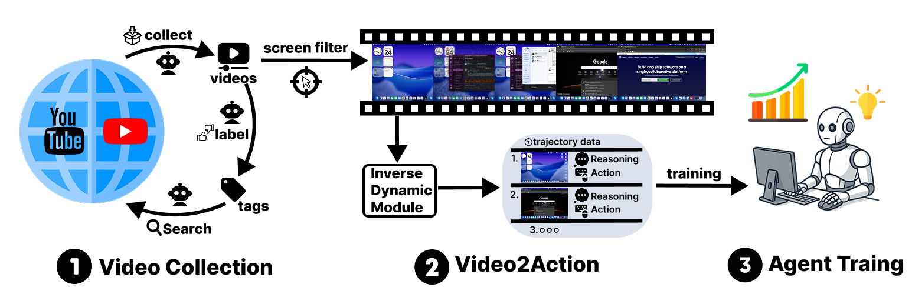

<h1 align="center" style="font-family:-apple-system,BlinkMacSystemFont,'Segoe UI',Helvetica,Arial,sans-serif; font-size:48px; font-weight:700; line-height:1.25; margin:0 0 24px;">
  VideoAgentTrek: Computer Use Pretraining from Unlabeled Videos
</h1>

<p align="center">
  🌐 <a href="https://videoagenttrek.github.io/">Website</a>&nbsp;&nbsp; | &nbsp;&nbsp;📑 <a href="https://arxiv.org/abs/2510.19488/">Paper</a>&nbsp;&nbsp; | &nbsp;&nbsp;🤗 <a href="https://huggingface.co/collections/xlangai/videoagenttrek-computeruse-pretraining-from-unlabeled-video">Models</a>&nbsp;&nbsp; 
</p>

<div align="center">
  
</div>

<div style="max-width:900px; margin:10 auto;">

# Introduction

<div style="max-width:880px; margin:0 auto; text-align:justify; text-justify:inter-word; line-height:1.6;">

**VideoAgentTrek** is a video-driven pretraining pipeline for computer-use agents that turns in-the-wild screen-recorded tutorials into structured action trajectories—no manual annotation required. It detects GUI events directly from pixels, reconstructs parameters like click coordinates and typed text, and then trains agents with a two-stage recipe (video pretraining → supervised finetuning) to generalize across real apps and OSes.

**Key Features & Contributions**

- 🎥 **Web-scale mining from unlabeled videos**: 39k YouTube tutorials → 1.52M interaction steps.
- 🧩 **Video2Action (inverse dynamics)**: recovers detailed agent trajectories from raw screen video.
- 🧠 **Two-stage training**: continued pretraining on mined trajectories, then SFT on curated data.
- 📈 **Strong results online & offline**: OSWorld-Verified 15.8%; AgentNetBench 69.3%.

</div>

## 🚀 Quick Start

### Installation

```bash
# Create environment
conda create -n videoagenttrek python=3.10
conda activate videoagenttrek

# Install dependencies
pip install -r requirements.txt

# Install FFmpeg
# Ubuntu/Debian
sudo apt install ffmpeg

# macOS
brew install ffmpeg
```

### Download Models

Download the required models from our 🤗 [Hugging Face Collection](https://huggingface.co/collections/xlangai/videoagenttrek-computeruse-pretraining-from-unlabeled-video):

```bash
# Install huggingface-hub
pip install -U huggingface_hub

# Download cursor detection model for preprocessing
huggingface-cli download xlangai/VideoAgentTrek-ScreenFilter \
    --local-dir ./models/cursor-detection

# Download keyframe detection model for Video2Action
huggingface-cli download xlangai/VideoAgentTrek-IDM-s1-7B \
    --local-dir ./models/keyframe-detector

# Download action identification model for Video2Action 
huggingface-cli download xlangai/VideoAgentTrek-IDM-s2-7B \
    --local-dir ./models/action-identifier
```

### Environment Setup

Set up environment variables for model paths and API keys:

```bash
# Required: Model paths (use the paths where you downloaded the models)
export YOLO_MODEL_PATH="./models/cursor-detection/best.pt"
export KEYFRAME_MODEL_PATH="./models/keyframe-detector"
export ACTION_MODEL_PATH="./models/action-identifier"

# Required: API key (for validation and inner monologue)
export OPENAI_API_KEY="sk-your-api-key"

# Optional: Use DashScope instead of OpenAI
export OPENAI_BASE_URL="https://dashscope.aliyuncs.com/compatible-mode/v1"
export OPENAI_MODEL="qwen3-vl-plus"
```

### Running the Pipeline

**Step 1: Prepare your data**

Organize videos in the following structure:
```
raw_data/
└── video_id/
    ├── video_id.mp4                # Required: screen recording
    └── video_id_transcript.json    # Optional: narration/speech
```

**Step 2: Preprocess videos (cursor detection)**

```bash
python video_preprocess.py
```

This filters videos based on cursor presence to ensure GUI interactions.

**Step 3: Extract trajectories (Video2Action pipeline)**

```bash
# Process specific video
python video2action.py video_id

# Process all videos that passed preprocessing
python video2action.py
```

**Step 4: Check results**

```bash
# View final trajectory with actions and inner monologues
cat output_video2action/trajectories/video_id_trajectory.json

# Inspect intermediate outputs from all 8 stages
ls -lh output_video2action/workspace_video_id/
```


## 📚 Citation

If you use VideoAgentTrek in your research, please cite our work:

```bibtex
@misc{lu2025videoagenttrekcomputerusepretraining,
      title={VideoAgentTrek: Computer Use Pretraining from Unlabeled Videos}, 
      author={Dunjie Lu and Yiheng Xu and Junli Wang and Haoyuan Wu and Xinyuan Wang and Zekun Wang and Junlin Yang and Hongjin Su and Jixuan Chen and Junda Chen and Yuchen Mao and Jingren Zhou and Junyang Lin and Binyuan Hui and Tao Yu},
      year={2025},
      eprint={2510.19488},
      archivePrefix={arXiv},
      primaryClass={cs.CL},
      url={https://arxiv.org/abs/2510.19488}, 
}
```


## 🤝 Acknowledgements

We thank Fan Zhou, Tianbao Xie, and the anonymous reviewers for their insightful discussions and valuable feedback. We also sincerely appreciate Alibaba Qwen Team for their strong infrastructure support and helpful guidance. This paper's authors received support from the ECS (27212023) provided by the RGC of Hong Kong.

</div>
