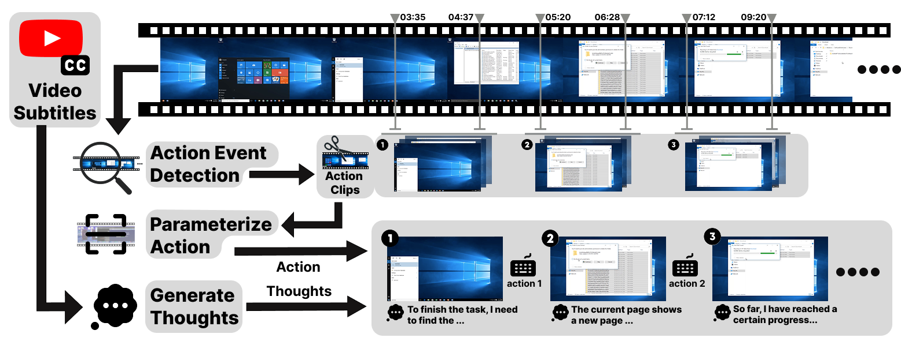

# Video2Action

## Overview

The Video2Action pipeline automatically processes screen recordings and extracts structured GUI interaction trajectories. 

<div align="center">
  
</div>

## Pipeline Stages

```
Raw Video → Split → Keyframe Detection → Action Clipping → Action Identification → Validation → Training Data
```

1. **Video Splitting**: Splits long videos into 10-second segments
2. **Keyframe Detection**: Detects timestamps of GUI actions
3. **Action Clipping**: Extracts specific video clips for each detected action
4. **Action Identification**: Uses VLM to identify detailed action parameters
5. **Trajectory Building**: Combines keyframes, actions, and transcripts
6. **Validation**: GPT validates action authenticity
7. **Export**: Exports clean, validated trajectories

## Output Format

The pipeline produces a trajectory JSON file with the following structure:

```json
{
  "video_id": "demo_video",
  "valid_actions": [
    {
      "action_type": "left_click",
      "keyframes": {
        "start_frame": {
          "base64": "data:image/jpeg;base64,...",
          "format": "JPEG"
        },
        "end_frame": {
          "base64": "data:image/jpeg;base64,...",
          "format": "JPEG"
        }
      },
      "transcripts": {
        "before": "...",
        "during": "...",
        "after": "..."
      },
      "parsed_actions": [
        {
          "index": 1,
          "action": "left_click",
          "coordinate": [100, 200]
        }
      ],
      "resized_width": 896,
      "resized_height": 672,
      "action_validation": {
        "valid": true,
        "detected_action": "left_click",
        "reason": "Click event detected on UI element"
      }
    }
  ]
}
```