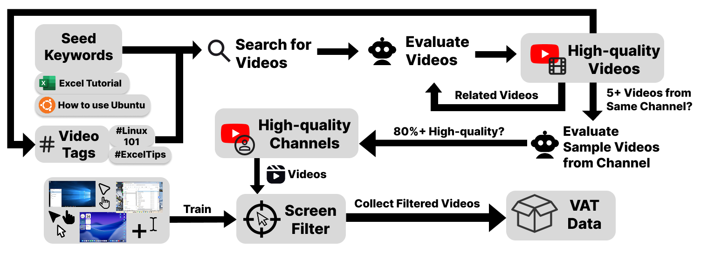

# Video Preprocessing
## Overview

This module filters videos based on cursor activity to identify high-quality screen recordings suitable for trajectory extraction. Videos with ≥50% cursor presence are kept for further processing.

  

